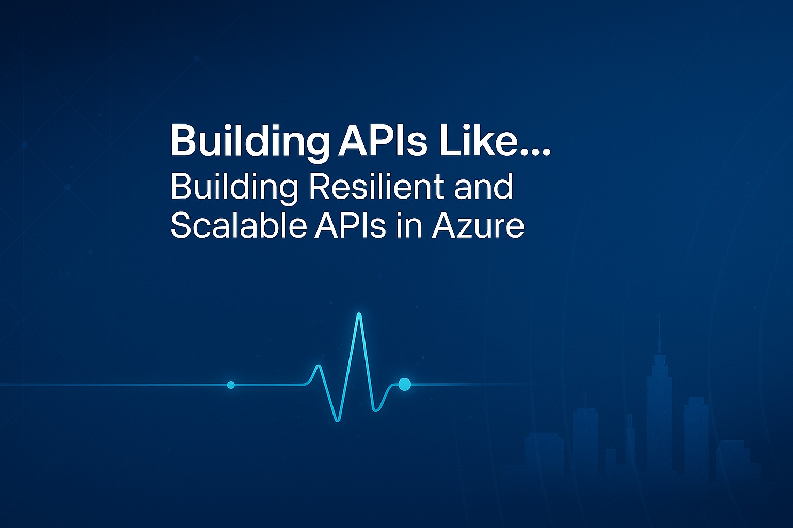

## Short Abstract
Resilient APIs fuel scalable applications. Learn how Azure API Management, Functions, and Azure Container Apps work together to create reliable, high-performing API architectures.

## Abstract
Modern applications demand APIs that can withstand failures and dynamically scale to meet demand. In this session, we’ll explore how Azure API Management, Azure Functions, and Azure Container Apps can help design resilient and scalable APIs that remain operational under pressure.

- High Availability & Disaster Recovery: Architecting APIs to ensure seamless failover and minimal downtime.
- Resilience Strategies: To enhance reliability, implement retry policies, circuit breakers, and throttling.
- Monitoring & Observability: Using Azure Monitor and Application Insights for real-time performance tracking.
- Live Demo & Real-World Scenarios: Watch Azure tools in action as we integrate resilience techniques into a scalable API framework.

Whether you’re a developer, architect, or IT professional, this session provides actionable strategies for future-proofing your APIs and optimizing their reliability in cloud-native environments.

# Type
- 45/60/75-minute session

## Tags
   

## Learning Objectives
- **Resilient API Design:** Ensuring high availability & fault tolerance.
- **Scalability Techniques:** Using Azure services to scale APIs dynamically.
- **Observability Best Practices:** Monitoring APIs effectively for performance & security.

## Presentations

| Event | Location | Date | Time | Room | Downloads |
|-------|:--------:|-----:|-----:|-----:|----------:|
| [API Conference New York 2025](https://apiconference.net/new-york/)  (1) | New York, NY | September 29 - October 2, 2025 | TBA | TBA | Available Afterwards |
| [API Conference Berlin 2025](https://apiconference.net/berlin/) (2) | Berlin, Germany | October 20 - 22, 2025 | TBA | TBA | Available Afterwards |

(1) Listed as Scaling APIs Like a City That Never Sleeps: Building Resilient APIs in Azure  
(2) Listed as Scaling APIs Like the Heart of Berlin: Building Resilient APIs in Azure

## Resources

There are no additional resources for this presentation.

Email [chadgreen@chadgreen.com](mailto:chadgreen@chadgreen.com?subject=Presentation%20Request:%20Presentation%20Title) to have Chad present this session at your event.